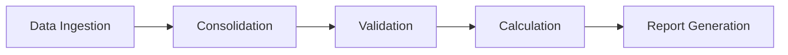

# 🎯 Automação VR/VA - Sistema Multiagente com LangGraph

## 📋 Objetivo Geral

Sistema de automação para geração mensal da planilha de compra de Vale Refeição (VR) e Vale Alimentação (VA), consolidando dados de múltiplas fontes, aplicando regras sindicais e gerando arquivo final para operadora de benefícios.

## 🔧 Tecnologias

- **Python 3.11+**
- **LangGraph** - Orquestração de agentes
- **LangChain** - Framework de IA
- **Pandas** - Manipulação de dados
- **OpenPyXL** - Processamento Excel
- **UV** - Gerenciador de pacotes

## 🏗️ Arquitetura

### Metodologia
Sistema multiagente baseado em grafo dirigido (DAG) com 5 agentes especializados executando em pipeline sequencial. Cada agente processa e enriquece o estado compartilhado até gerar o relatório final.

### Fluxo de Agentes



## 🤖 Agentes

| Agente | Responsabilidade | Entrada | Saída |
|--------|-----------------|---------|--------|
| **DataIngestionAgent** | Lê planilhas Excel e padroniza formatos | Arquivos Excel | Dict com DataFrames |
| **ConsolidationAgent** | Unifica dados usando matrícula como chave | DataFrames separados | DataFrame consolidado |
| **ValidationAgent** | Remove exclusões (diretores, estagiários) e valida datas | DataFrame consolidado | DataFrame validado |
| **CalculationAgent** | Calcula dias úteis e valores VR por sindicato | DataFrame validado | DataFrame com cálculos |
| **ReportGenerationAgent** | Gera planilha final no formato da operadora | DataFrame calculado | Excel formatado |

## 📦 Instalação

### Pré-requisitos
```bash
# Instalar UV
curl -LsSf https://astral.sh/uv/install.sh | sh
```

### Setup do Projeto
```bash
# Clonar repositório
git clone <repository-url>
cd Desafio_4_Automacao_Compra_VR_v01

# Criar ambiente virtual com UV
uv venv

# Ativar ambiente
source .venv/bin/activate  # Linux/Mac
# ou
.venv\Scripts\activate  # Windows

# Instalar dependências
uv sync
```

## ⚙️ Configuração

O sistema utiliza configuração centralizada em `src/config.py`. Os principais parâmetros são:

- **PROCESSING_MONTH**: "05/2025" (mês padrão de processamento)
- **CUTOFF_DAY**: 15 (regra do dia 15 para desligamentos)
- **COMPANY_PERCENTAGE**: 0.8 (80% empresa)
- **EMPLOYEE_PERCENTAGE**: 0.2 (20% colaborador)
- **EXCLUDED_POSITIONS**: Cargos excluídos (diretores, gerentes gerais, etc.)

## 🚀 Execução

### Processamento Padrão
```bash
python run.py
```

### Com Parâmetros
```bash
python run.py --month 05/2025 --validate-only
```

## 📊 Estrutura de Dados

### Estado Compartilhado
```python
class VRState(TypedDict):
    raw_files: Dict[str, pd.DataFrame]
    consolidated_df: Optional[pd.DataFrame]
    validated_df: Optional[pd.DataFrame]
    calculated_df: Optional[pd.DataFrame]
    final_report: Optional[pd.DataFrame]
    month_year: str
    errors: List[Dict]
    warnings: List[Dict]
    stats: Dict[str, int]
```

## 🧪 Testes

```bash
# Executar testes (se configurado)
python -m pytest tests/

# Validar ambiente antes de executar
python run.py --validate

# Modo debug para troubleshooting
python run.py --debug
```

## 📈 Validações Implementadas

- ✅ Datas consistentes (admissão, desligamento, férias)
- ✅ Exclusão de inelegíveis (diretores, estagiários, aprendizes)
- ✅ Regra do dia 15 para desligamentos
- ✅ Cálculo proporcional para admissões
- ✅ Dias úteis por sindicato
- ✅ Feriados estaduais e municipais
- ✅ Proporção 80/20 (empresa/colaborador)

## 🔍 Monitoramento

### Logs
```python
# Localização: logs/vr_processing_YYYYMMDD_HHMMSS.log
2025-08-25 10:00:00 - INFO - Iniciando processamento VR 05/2025
2025-08-25 10:00:05 - INFO - 1523 colaboradores carregados
2025-08-25 10:00:10 - WARNING - 15 registros com datas inconsistentes
2025-08-25 10:00:30 - INFO - Processamento concluído: 1420 elegíveis
```

### Métricas
- Total de colaboradores processados
- Exclusões por categoria
- Tempo de processamento por agente
- Taxa de validação bem-sucedida

## 🐛 Troubleshooting

| Problema | Solução |
|----------|---------|
| `FileNotFoundError` | Verificar se todos os 11 arquivos estão em `data/input/` |
| `KeyError: 'MATRICULA'` | Padronizar nomes de colunas nas planilhas |
| `ValueError: Data inválida` | Verificar formato de datas (DD/MM/YYYY) |
| Ambiente inválido | Executar `python run.py --validate` para diagnóstico |
| Erros de processamento | Usar `python run.py --debug` para logs detalhados |

## 📝 Exemplo de Saída

```excel
# YYYYMMDD_HHMMSS_vr_final_report.xlsx
| MATRICULA | NOME | SINDICATO | DIAS_UTEIS | VALOR_DIA | VALOR_TOTAL | EMPRESA_80% | COLABORADOR_20% |
|-----------|------|-----|-----------|------------|-----------|-------------|-------------|-----------------|
| 001234 | João Silva | SIND_A | 22 | 35.00 | 770.00 | 616.00 | 154.00 |
```

